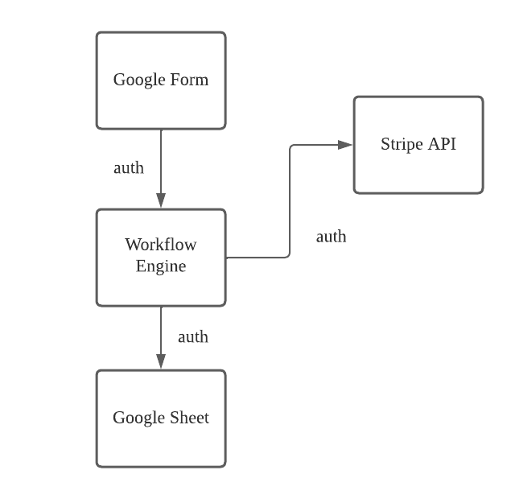

# Workflow Engine
> Designing a workflow engine 

## Prompt

 https://github.com/syangragh/saas-backend-with-cloud-apis/blob/main/shopping_payment_automation.md

 ## Architectural Diagram

 

 ## References
 - https://neartail.com/order-form/google-forms-payment-options.html
 - https://codeburst.io/automating-google-forms-sheets-using-apps-script-2c59db97966f

